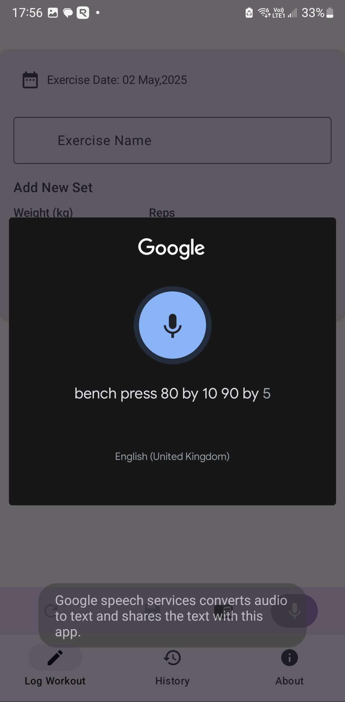
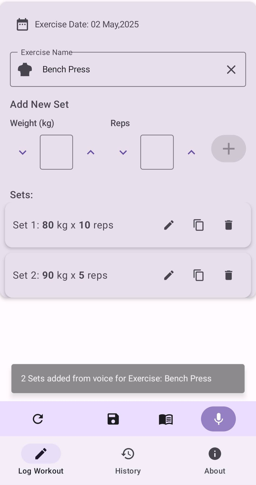
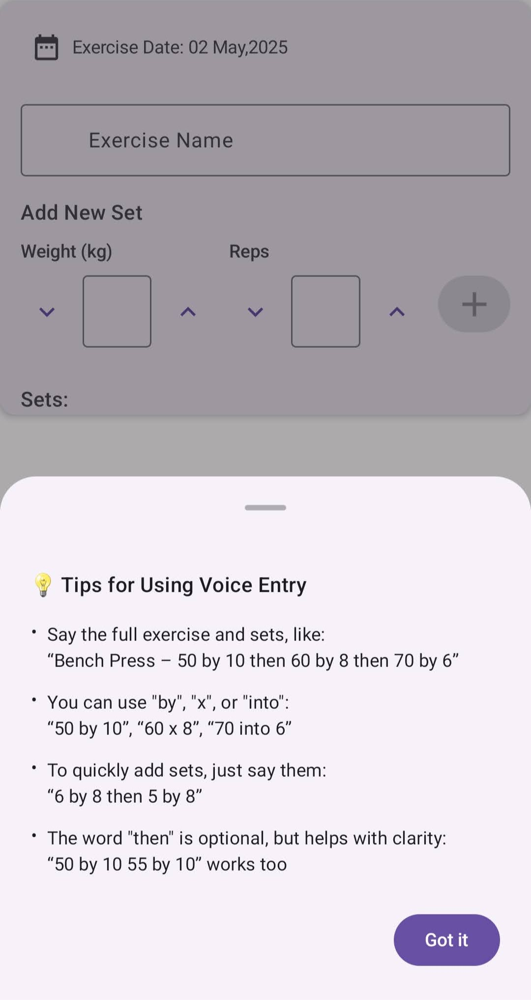
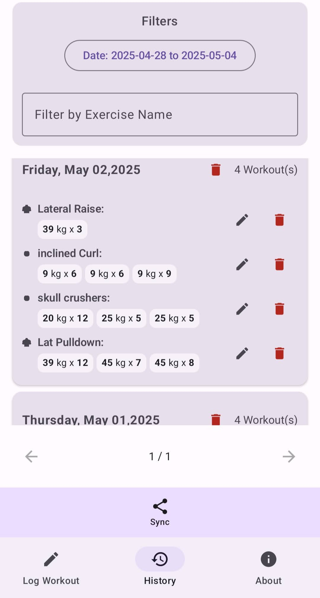
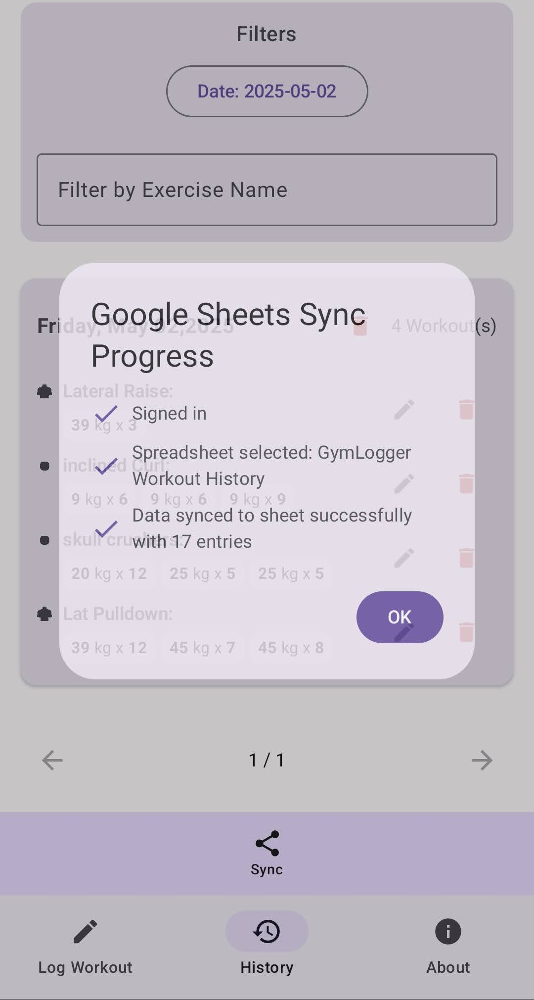

# 🏋️‍♂️ GymLogger – Log Your Workouts with Just Your Voice!

GymLogger is the simplest way to track your weight training progress — with powerful voice input and a clean, no-fuss interface built for lifters who want results, not clutter.

Whether you're crushing squats or repping bicep curls, just say it and log it.

No more fiddling with your phone between sets.

## Download

Note: You'll need to allow unknown source in your phone to install this App
[https://drive.google.com/drive/folders/11B6N7NHwC56MF3QgLTWeGaxpwEbfpNUw?usp=drive_link](https://drive.google.com/drive/folders/11B6N7NHwC56MF3QgLTWeGaxpwEbfpNUw?usp=drive_link)

## 🎙️ Key Features:

-   Voice Logging – Just say “Bench press 80 by 8” and it's logged!
-   Manual Entry – Prefer to type? Choose from popular exercises or add your own.
-   Google Sheets Sync – Backup your data to Google Sheets for easy access anywhere.
-   Edit & Delete Logs – Fix mistakes or update old entries anytime.
-   Minimalist UI – A clean, intuitive interface that gets out of your way.

## 💡 Why GymLogger?

-   No sign-ups, no subscriptions — just lift and log.
-   Designed for fast, frictionless logging during or after your workout.
-   Built for lifters, by lifters. 🏆

## Feature Screenshots

### Log your workout via voice

### Voice and manual data entry support

### Flexible voice input

### View Workout History

### Sync your data to Google Sheets

## Contact for App Feedback
[gymloggerapp@gmail.com](mailto:gymloggerapp@gmail.com)

